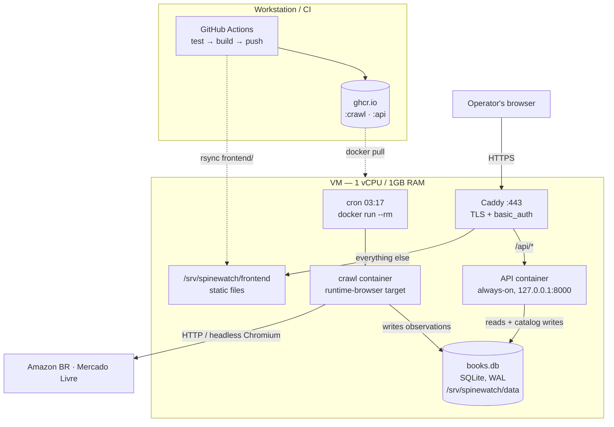
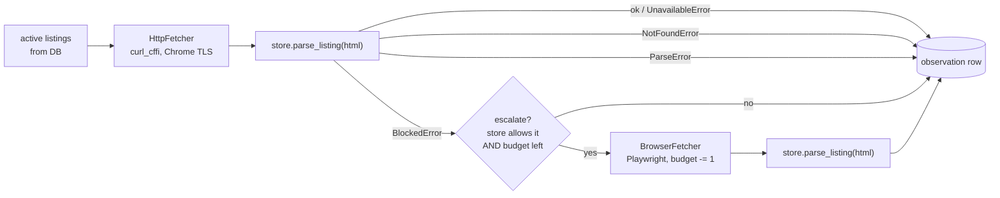
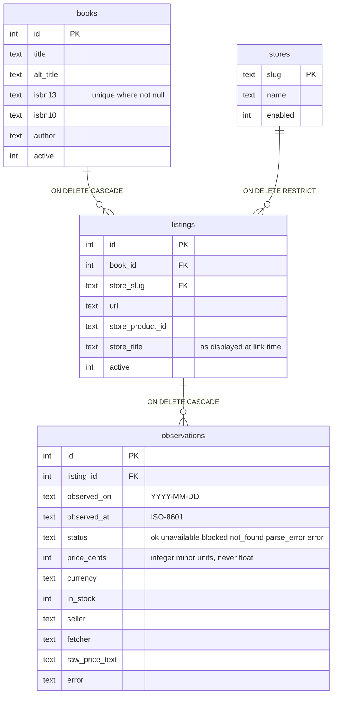
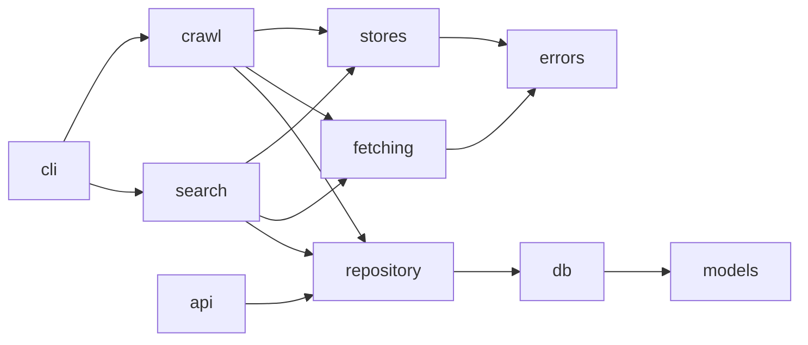
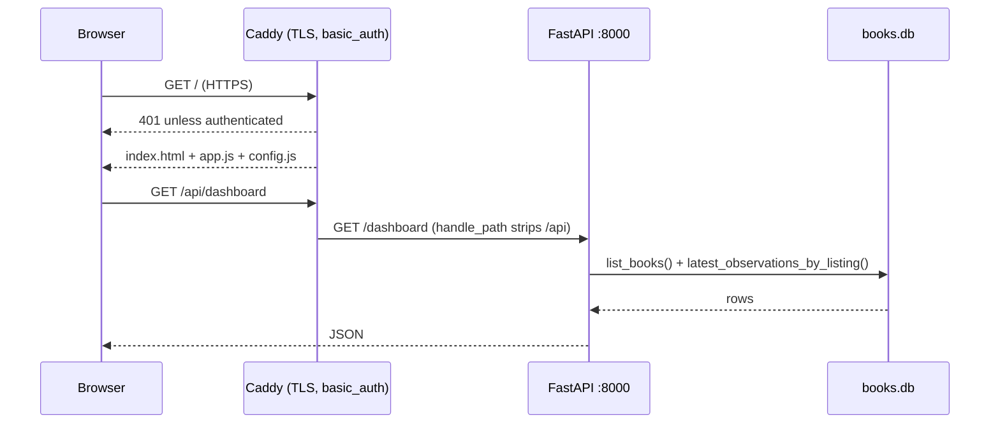
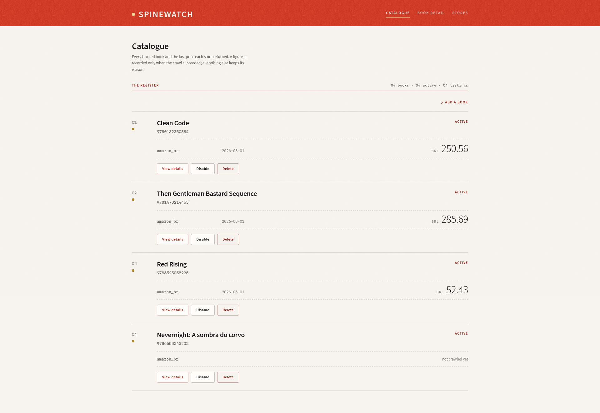
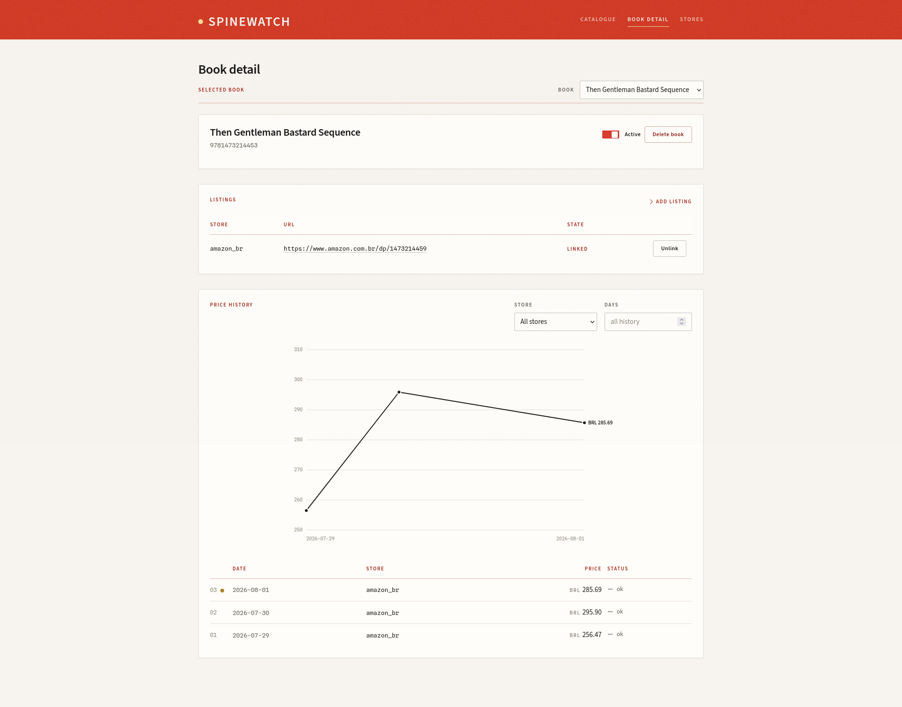
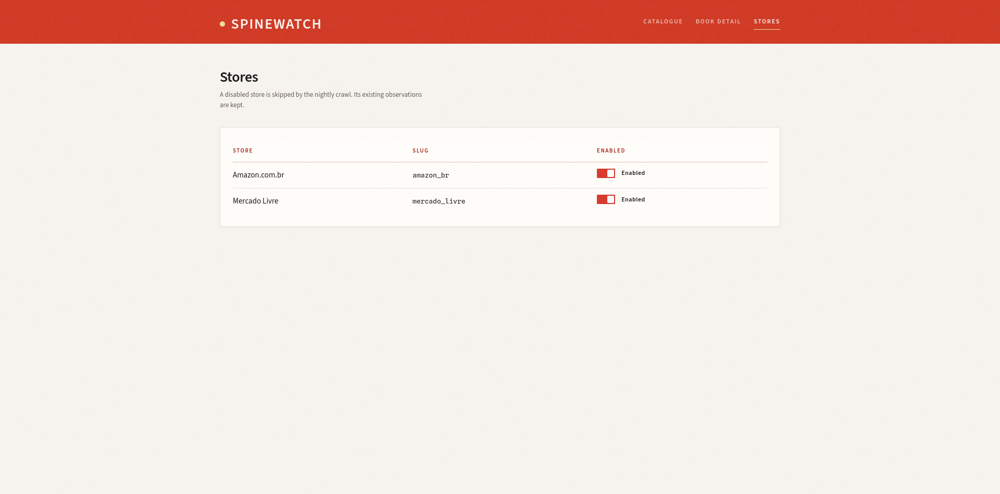
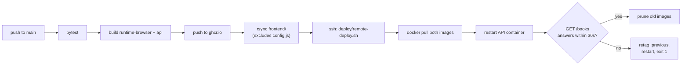

# Spinewatch

Tracks what a list of books costs across online bookstores — Amazon BR, Mercado Livre, and whatever else gets added — recording one price observation per book, per store, per day into SQLite. The point is the history: knowing what a book cost in March, not just what it costs now.

It is three things sharing one database:

- a **CLI** (`books`) that manages the catalog and runs the nightly crawl,
- a **JSON API** (FastAPI) the web UI calls,
- a **static frontend** (vanilla HTML/CSS/JS, no build step) to browse and manage it all.

All of it runs on one 1GB always-free VM (Oracle Cloud / GCP `e2-micro` class), behind Caddy with HTTP basic auth. 241 tests, none of which touch the network.

> The design docs (`docs/`) are deliberately **not committed** — they're working notes. This file carries everything a reader actually needs: what it is, how it works, and how the parts talk to each other.

---

## 1. System shape



One writer, many readers. WAL mode is what lets the nightly crawl write while the API serves reads from the same file without either blocking the other.

The crawl container is **one-shot** (`--rm`): a crash leaves nothing to clean up, memory is fully reclaimed between runs, and nothing idles on a 1GB box. The API container is the opposite — long-lived, because the frontend can ask at any time, not just at 03:17.

---

## 2. The crawl

A book is linked **once** to a product URL on each store, and the daily crawl re-fetches those URLs. It does not re-search every night — search results drift between editions, used copies, and box sets, and a price series built on that would be measuring something different each day.



Ordering and politeness: listings are grouped by store, shuffled within each group, and visited **sequentially**, sleeping a jittered delay between same-store requests. Sequential is deliberate — wall clock isn't a constraint (nightly batch, nobody waits), and concurrent browser escalations are exactly what would breach the memory ceiling.

**Only `BlockedError` escalates.** Escalating a `ParseError` would spend 20 seconds and ~200MB handing the same broken parser the same content. The budget (`--max-escalations`, default 25) bounds the worst case: a night when a store blocks everything costs a bounded amount of browser time, leaves the rest of the catalog crawled, and records the overflow as `blocked` to retry tomorrow.

Chromium is launched lazily — a run with no blocks never starts it — and when it does start, it aborts every request whose resource type is image, font, media, or stylesheet. That one rule is the most important line of configuration in the system: the price is in the HTML, and rendering product carousels and web fonts to find it is what would push a 1GB box into the OOM killer.

The run summary prints counts by status, duration and escalations used; the exit code is non-zero if *no* listing succeeded, so cron surfaces a total outage.

---

## 3. Failure is data

Every crawl attempt writes a row with an explicit status. A failed scrape is never recorded as a missing day or a zero price — and that distinction is enforced by a schema constraint, not by convention.

| Exception | Status | Meaning |
|---|---|---|
| — | `ok` | Price extracted. The only status that carries a price. |
| `UnavailableError` | `unavailable` | Page parsed fine; no purchasable offer. A real fact, not a failure. |
| `BlockedError` | `blocked` | CAPTCHA, 403, bot interstitial. The page was withheld. **Escalation candidate.** |
| `NotFoundError` | `not_found` | 404 or "no longer available". The listing may be stale. |
| `ParseError` | `parse_error` | Page fetched, not blocked, price not extractable. **This is the parser-regression signal.** |
| anything else | `error` | Network failure, timeout, adapter bug. Message retained. |

`blocked` vs `parse_error` is the distinction that matters operationally: rising `blocked` means the store is fighting back and escalation policy needs tuning; rising `parse_error` means the adapter needs fixing. Collapsing them erases the only signal that says which problem you have.

---

## 4. Data model



Two constraints carry most of the weight:

- **`UNIQUE (listing_id, observed_on)`** — combined with `INSERT … ON CONFLICT DO UPDATE`, running the crawl twice in a day updates rather than duplicates, and a mid-morning retry can promote a `blocked` row into an `ok` row. It's also why an interrupted run needs no bookkeeping to resume: just run it again.
- **`CHECK ((status = 'ok') = (price_cents IS NOT NULL))`** — a price exists exactly when the crawl succeeded. There is no path by which a parse failure becomes a `0.00` in a price chart.

`store_title` records the product name as the store displayed it at link time. When a parser starts returning a suspicious price, comparing today's page title against it is the fastest way to tell "the store changed its markup" from "this listing now points at a different edition".

Schema versioning is `PRAGMA user_version` plus an ordered list of migration callables in `db.py`, applied inside one transaction on connect. No Alembic: four tables, one writer, one deployment.

---

## 5. Module layout

```
spinewatch/
  cli.py          Typer app. Argument parsing and table rendering only.
  api.py          FastAPI app. Thin wrapper over repository.py.
  config.py       Settings resolved from environment, with defaults.
  models.py       Dataclasses + ISBN normalization. No I/O.
  db.py           Connection, schema, PRAGMA user_version migrations.
  repository.py   Every SQL statement in the system lives here.
  errors.py       Exception taxonomy shared by fetching and stores.
  crawl.py        Orchestration of the pipeline in §2.
  search.py       Assisted linking flow.
  fetching/
    base.py       Fetcher protocol, FetchResult
    http.py       HttpFetcher — curl_cffi with Chrome TLS impersonation
    browser.py    BrowserFetcher — Playwright, imported lazily
  stores/
    __init__.py   Auto-discovery registry (pkgutil walk of this package)
    base.py       Store ABC
    amazon_br.py  One file per store
    mercado_livre.py
frontend/         Static page: index.html, app.js, style.css, config.js
deploy/           Caddyfile + remote-deploy.sh (run on the VM by CI)
tests/fixtures/   Saved store HTML — what makes parser tests run offline
```

Dependencies point one way and never back:



`repository` knows nothing about stores or HTTP; `stores` knows nothing about the database. That's what makes `api.py` a thin wrapper — it imports `repository` and `models` and gets the whole read path without dragging in Typer, curl_cffi, or Playwright. `models.py` doing no I/O is also deliberate: ISBN normalization and checksums are pure functions and the easiest thing in the system to test exhaustively.

---

## 6. Store adapters

Adding a store is adding one file under `spinewatch/stores/`; removing it is deleting that file. No existing file is edited either way — `stores/__init__.py` walks its own package with `pkgutil.iter_modules` and collects every concrete `Store` subclass into a registry keyed by `slug` (duplicate slugs raise at import time). Before each crawl, the registry is upserted into the `stores` table, so new adapters appear enabled and vanished adapters leave their history intact.

```python
class Store(ABC):
    slug: str                                  # stable key, matches stores.slug
    name: str
    allow_browser_fallback: bool = True
    request_delay: tuple[float, float] = (2.0, 5.0)

    @abstractmethod
    def parse_listing(self, html: str, url: str) -> Listing:
        """Extract price, currency, stock, seller. Raise on failure."""

    def search(self, query: str) -> list[Candidate]:
        """Optional. Default raises SearchNotSupported."""

    def matches_url(self, url: str) -> bool:
        """Does this URL belong to this store? Used by `books link`."""

    def normalize_url(self, url: str) -> str:
        """Strip tracking/affiliate/session parameters."""
```

`parse_listing` touches neither network nor database — which is why a store's entire behavior can be tested against a saved HTML file. Prefer structured data (JSON-LD `Product`/`Offer`, inline JSON state) over CSS selectors: retail sites rewrite their CSS constantly and their structured markup rarely, because search engines consume it. Parse to `price_cents` via `Decimal`, never `float`, and keep the raw matched string in `raw_price_text`.

---

## 7. The API and the frontend

The frontend is plain HTML/CSS/JS — no framework, no build step, no bundler. Three views: a **dashboard** (every book with its listings and each listing's current price), a **book detail** view (history table + chart, listing management), and a **stores** view.



| Endpoint | Backed by | Purpose |
|---|---|---|
| `GET /dashboard` | `list_books()` + `latest_observations_by_listing()` | Every book, its listings, each listing's latest price — one call, no N+1 |
| `GET /books` | `list_books()` | Book list |
| `GET /stores` | `list_stores()` | Store list |
| `GET /books/{id}/listings` | `list_listings_for_book()` | Which stores a book is linked to |
| `GET /books/{id}/history?store=&days=` | `observations_for_book()` | The history table |
| `POST /books` | `add_book()` | Add a book |
| `PATCH /books/{id}` | `set_book_active()` | Enable/disable a book |
| `DELETE /books/{id}` | `delete_book()` | Delete a book and its history |
| `PATCH /stores/{slug}` | `set_store_enabled()` | Enable/disable a store |
| `POST /books/{id}/listings` | `link_listing()` | Link a store URL to a book |
| `PATCH /books/{id}/listings/{listing_id}` | `set_listing_active()` | Unlink/relink a listing |

Writes reuse the CLI's validation path — a book needs a title or an ISBN, a bad ISBN checksum is a 400 via `models.resolve_isbn`, and a listing URL matching no registered adapter is a 400 via `stores.store_for_url()`. Everything the CLI can do is reachable except adding a *new* store adapter, which is a code change, not a web form.

Prices stay in integer cents in the API response; the frontend divides by 100 at render time. Non-`ok` rows are carried through untouched and rendered as text instead of a price — a UI that quietly dropped them would show a gap as "no price change" instead of "we couldn't check".

**Auth lives in Caddy, not in the app.** There is no auth code in `api.py` at all. A shared key in `config.js` would be readable by every visitor, so the gate sits one layer up: basic auth in front of the whole site, reads included. Single-operator tool, no anonymous audience, so gating reads costs nothing. The API container therefore binds to `127.0.0.1:8000` only — anything that reaches it directly can do everything.

**Catalogue** — every tracked book, its listings, and the latest price each store returned.



**Book detail** — price history chart plus the full observation table for one book.



**Stores** — enable or disable a store; a disabled store is skipped by the nightly crawl but keeps its history.



---

## 8. Setup

Requires Python 3.13 or 3.14 (the upper bound is `selectolax`'s).

```bash
python3 -m venv venv
venv/bin/python -m pip install -e ".[browser,api]" --group dev
venv/bin/playwright install chromium     # only needed for the browser fallback
```

Drop `[browser]` to skip Playwright — the fallback is optional and the code must import without it (the browser-free `runtime` Docker target is the proof). Drop `[api]` if you only want the CLI. Drop `--group dev` to skip pytest.

## 9. CLI

```bash
books init                                    # create the database
books book add --title "..." --isbn ...       # add a book to track
books book list | book rm | book enable | book disable
books search <book_id> --store amazon_br      # find it on a store, confirm the match
books link <book_id> <url>                    # or paste a product URL directly
books links <book_id> | unlink <listing_id>
books store list | store enable | store disable
books crawl                                   # fetch today's prices — this is what cron runs
books crawl --dry-run --only-store amazon_br --book 3 --force --max-escalations 5
books history <book_id> --days 90 --store amazon_br
books export --csv prices.csv
books fixture save <url>                      # refresh a parser's test HTML
```

Running the web UI locally: see [frontend/README.md](frontend/README.md).

## 10. Configuration

Everything tunable is an environment variable read by `config.py`, with defaults baked into the image.

| Variable | Default | Notes |
|---|---|---|
| `SPINEWATCH_DB_PATH` | `books.db` | `/data/books.db` in the images |
| `SPINEWATCH_REQUEST_DELAY_MIN` / `_MAX` | `2.0` / `5.0` | Jittered politeness delay, same store |
| `SPINEWATCH_HTTP_TIMEOUT` | `20.0` | |
| `SPINEWATCH_BROWSER_TIMEOUT` | `30.0` | |
| `SPINEWATCH_MAX_ESCALATIONS` | `25` | Browser escalations per run |
| `SPINEWATCH_FIXTURE_DIR` | `tests/fixtures` | Where `books fixture save` writes |
| `SPINEWATCH_LOG_LEVEL` | `INFO` | |
| `SPINEWATCH_CORS_ORIGINS` | *(empty)* | Comma-separated. Unneeded when Caddy serves both from one origin; needed for local dev |

The images set no `TZ`, so they run on UTC and `observed_on` is stamped with the container's local date. Pass `-e TZ=America/Sao_Paulo` if you run manual crawls in the evening and want local dates.

---

## 11. Deployment

Three Docker targets from one multi-stage `Dockerfile`:

| Target | Contents | Rough size | Runs as |
|---|---|---|---|
| `runtime` | app + curl_cffi + selectolax | ~275MB | nothing in prod — it's the standing proof that `BrowserFetcher`'s lazy import holds |
| `runtime-browser` | the above + Playwright/Chromium | ~1.95GB | the nightly `--rm` crawl container |
| `api` | app + FastAPI/uvicorn, no Playwright | small | the always-on API container |

Push to `main` runs [`.github/workflows/deploy.yml`](.github/workflows/deploy.yml):



The crawl image needs no restart — cron runs whatever `spinewatch:latest` points at next. `config.js` is excluded from the rsync so the VM's copy (`API_BASE = "/api"`) survives deploys. Caddy is **not** deployed by CI: it changes about once a year, and wiring a live proxy config to every push risks locking yourself out of your own box.

First-time VM provisioning — Docker, the 2GB swap file, the data directory and its SELinux `:z` caveat, the cron entry, logrotate, and installing Caddy with its credentials — is in [deploy/README.md](deploy/README.md).

## 12. Tests

```bash
venv/bin/pytest        # 241 passed
```

No test touches the network. Three layers:

1. **Pure unit tests** — ISBN normalization and checksums, URL normalization, price-string-to-cents. Cheap, exhaustive, catch the errors that would quietly corrupt data.
2. **Parser tests against fixtures** — real store HTML committed under `tests/fixtures/<slug>/`, one file per interesting case: normal product, out of stock, block page, 404, search results.
3. **Orchestration tests against a fake fetcher** — `crawl.py` driven by a `Fetcher` that returns canned results or raises on cue. These cover exception-to-status mapping, escalation budget arithmetic, `ParseError` not escalating, upsert idempotency, and one store's failure not aborting the run.

Fixture maintenance is the real ongoing cost of this system: store markup changes without notice and every change breaks a parser. That's a recurring chore to be made cheap, not a risk to be avoided — hence `books fixture save <url>`, which refreshes a broken parser's test data in one command. Run it on your workstation; inside a `--rm` container the default fixture directory isn't on the mounted volume, so the file vanishes when the container exits (or pass `-e SPINEWATCH_FIXTURE_DIR=/data/fixtures`).

---

## 13. Decisions worth not relitigating

- **Pinned URLs, not nightly search.** Search results drift between editions, used copies, and box sets; a "price drop" could just be a match to a paperback. One linking step per book buys a series that means one thing.
- **SQLite permanently — no ORM, no Postgres.** Four tables and about twenty queries. Hand-written SQL confined to `repository.py` is smaller, faster to reason about, and lets the schema-level integrity checks above be expressed directly.
- **Python adapters, not YAML + CSS selectors.** Both target stores put price data in JS state or need custom cleanup. A YAML mechanism plus a Python escape hatch is two code paths; one mechanism uniformly applied is cheaper.
- **Cron, not APScheduler.** A resident scheduler keeps a Python process and its memory alive all day on a box with none to spare, and adds "is the daemon still alive" to the operator's concerns.
- **Playwright as fallback, not as the fetcher.** Simplest mental model, highest success rate, completely incompatible with 1GB of RAM.
- **No concurrency in the crawl.** See §2.
